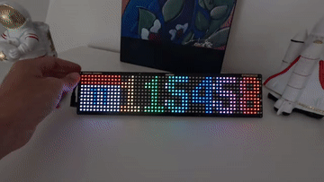

# UnicornClock



## Compatibility

- Pimoroni Galactic Unicorn
- Work in progress for the Pimoroni Cosmic Unicorn

## Installation

Copy the files into the device via [Thonny](https://thonny.org/) or the way
you want.

Create a `secrets.py` file:

```python
WLAN_SSID = 'Your WLAN SSID'
WLAN_PASSWORD = 'Your secrets password'
```

**TODO**

## Features

* NTP time
* Brightness adjustement (manually or automatically)
* Character animation
* Set the position of the clock
* Change the background color, the text, each letters
* You can change the spacing between each letters
* Create your own font
* Easily hackable
* Display a calendar frame
