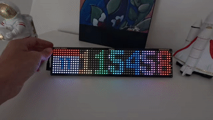

# UnicornClock



[Example video](https://www.youtube.com/watch?v=Gvnccr2_wY0)

## Compatibility

- Pimoroni Galactic Unicorn
- Work in progress for the Pimoroni Cosmic Unicorn

## Installation

Copy the files into the device via [Thonny](https://thonny.org/) or the way
you want.

Create a `secrets.py` file:

```python
WLAN_SSID = 'Your WLAN SSID'
WLAN_PASSWORD = 'Your secrets password'
```

### Example

The example display the calendar widget and the clock with an effect when
number changes.

* Adjust the brightness with the dedicated buttons
* Change the clock and calendar positions with A button
* Change the effect with B button

## Use

Here is a detailed example explaining how to use this project.

```python
import uasyncio as asyncio

# This imports is useful to configure the screen
from galactic import GalacticUnicorn
from picographics import DISPLAY_GALACTIC_UNICORN, PicoGraphics

# We want to update the brightness and change the position
from unicornclock import Brightness, Clock, Position

# Import the rainbow move effect
from unicornclock.effects import RainbowMoveEffect

# Load the GalacticUnicorn and PicoGraphics
galactic = GalacticUnicorn()
graphics = PicoGraphics(DISPLAY_GALACTIC_UNICORN)

# Here, we declare a rainbow clock by using the RainbowMoveEffect with Clock
class RainbowMoveEffectClock(RainbowMoveEffect, Clock):
    pass

async def example():
    # Create Brightness object for handling the brightness of the screen
    # depending of the brightness of the piece (screens have light sensors).
    brightness = Brightness(galactic)

    # Creating the Clock
    clock = RainbowMoveEffectClock(
        galactic,
        graphics,
        x=Position.CENTER,
        show_seconds=True,
        am_pm_mode=False,
    )

    # And now, we creating the 2 tasks
    asyncio.create_task(brightness.run())
    asyncio.create_task(clock.run())

loop = asyncio.get_event_loop()
loop.run_until_complete(example())
loop.run_forever()
```

## Features

* NTP time
* Brightness adjustement (manually or automatically)
* Character animation / effect
* Set the position of the clock
* Change the background color, the text, each letters
* You can change the spacing between each letters
* Create your own font
* Easily hackable
* Display a calendar frame
